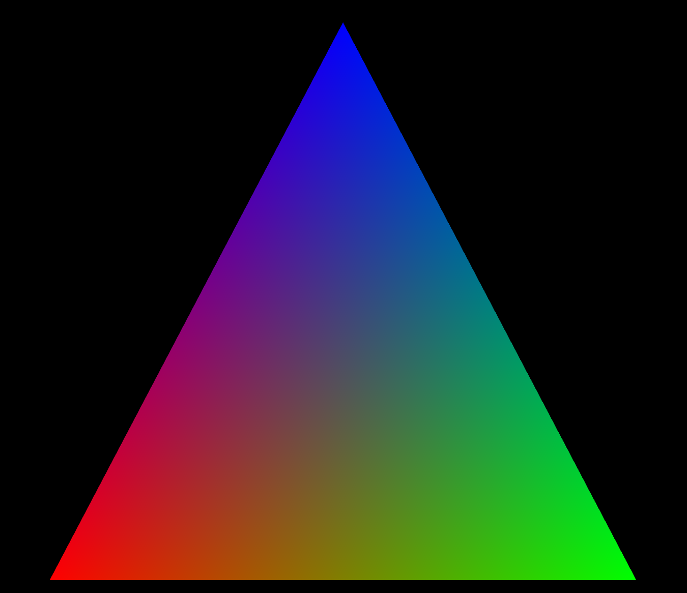

# webglutenfree

[](https://travis-ci.com/yanchith/webglutenfree)

We serve your draw calls type-safe and gluten-free.

Webglutenfree is a lightweight, comfort focused abstraction on top of WebGL2.
It abstracts away state manipulation, uses parameters instead of
state-setting calls, and encapsulates all GPU resident resources within helpful
handles.

On the scale from low-level and flexible to high-level and
opinionated, Webglutenfree leans towards flexibility. In general, 80-90% of
the *sensible* things possible with raw WebGL should be possible to do.
If you are missing a feature, please file an issue.

However, the library *is* opinionated in the sense that some things are just
"not a good idea" and strives to make invalid operations unexpressable both via
compile time checks and runtime assertions (the latter in dev mode only).

While it can be consumed directly from JavaScript, using TypeScript adds
compile time safety in terms of value dependent type parameters. For instance,
it won't allow you to store `Float32Array` data in a texture with `RGBA32UI`
internal format.

## Current State

We want to get to a `0.1.0` (meaning generally usable) eventually,
but there are still things missing:

- Documentation: we need a tutorial and API documentation,
- API stability: the API is still in flux,
- Features: we are missing at least Cubemaps, Texture Arrays, and Renderbuffers.

## Gallery

Have a look at our [gallery](https://yanchith.github.io/webglutenfree/)
(For the moment the gallery works only on browsers supporting both WebGL2 and ES
modules, e.g. Firefox and Chrome)

## Hello Triangle

Usually, you would acquire a `Device` (WebGL context) and create `Command`s
at init time. To draw, request a render target from the device and execute
draw commands with it.

```typescript
import { Device, ElementPrimitive } from "webglutenfree";

const dev = Device.create();
const cmd = dev.createCommand(
    `#version 300 es
    precision mediump float;

    layout (location = 0) in vec2 a_position;
    layout (location = 1) in vec4 a_color;

    out vec4 v_color;

    void main() {
        v_color = a_color;
        gl_Position = vec4(a_position, 0.0, 1.0);
    }
    `,
    `#version 300 es
    precision mediump float;

    in vec4 v_color;

    layout (location = 0) out vec4 f_color;

    void main() {
        f_color = v_color;
    }
    `,
);

const attrs = dev.createAttributes(ElementPrimitive.TRIANGLE_LIST, {
    0: [
        [-0.3, -0.5],
        [0.3, -0.5],
        [0, 0.5],
    ],
    1: [
        [1, 0, 0, 1],
        [0, 1, 0, 1],
        [0, 0, 1, 1],
    ],
});

dev.target((rt) => {
    rt.draw(cmd, attrs);
});

```




## Installation

`npm install --save webglutenfree` or `yarn add webglutenfree`

## Sources

Webglutenfree is inspired by:

- [regl](http://regl.party)
- [glium](https://github.com/glium/glium)

We found the following docs and tutorials helpful:

- [mdn](https://developer.mozilla.org/en-US/docs/Web/API/WebGL_API)
- [learnopengl.com](https://learnopengl.com/)
- [webgl2fundementals.org](https://webgl2fundamentals.org/)
